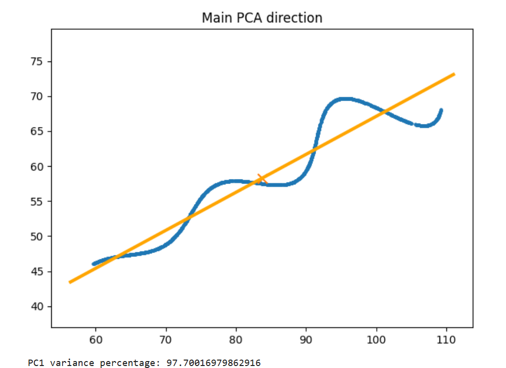
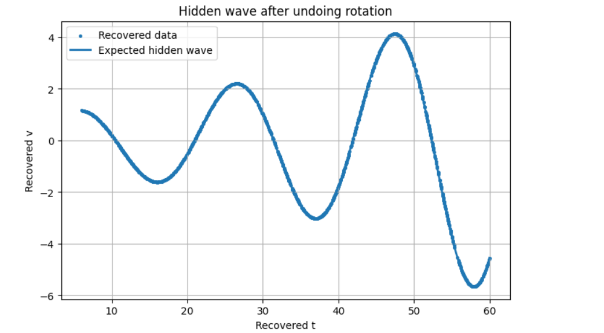
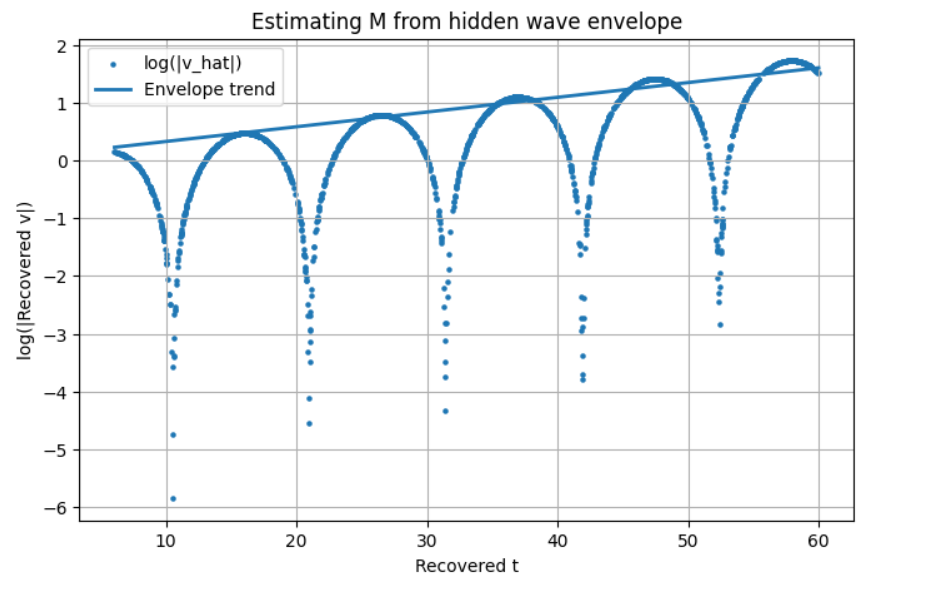
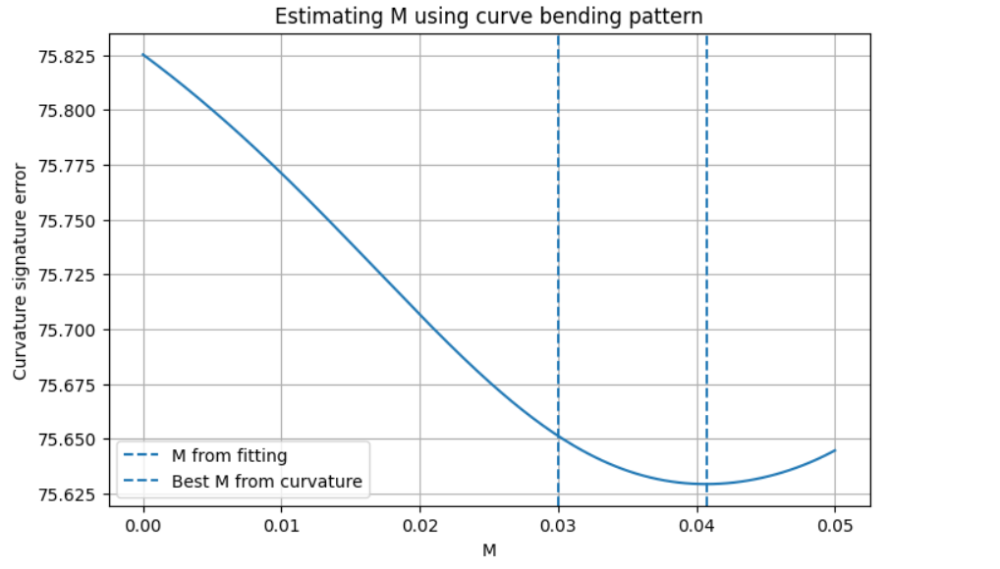

# Recovering Hidden Parameters of a Rotated Parametric Curve

Recover the unknown parameters of a rotated, exponentially modulated parametric curve using **only an unordered set of $(x,y)$ points**. The project combines geometric reasoning, Principal Component Analysis (PCA), and nonlinear least-squares optimization to recover the original curve without knowing the parameterization of any point.

---

# Final Result

The recovered parameters are

| Parameter                    |    Value |
| ---------------------------- | -------: |
| Rotation ($\theta$)          |  **30°** |
| Growth Parameter ($M$)       | **0.03** |
| Horizontal Translation ($X$) |   **55** |

## Interactive Visualization
The recovered parameters give the final latex string along with the Desmos link.

\left(t\cos(0.523599)-e^{0.03\left|t\right|}\sin(0.3t)\sin(0.523599)+55,\ 42+t\sin(0.523599)+e^{0.03\left|t\right|}\sin(0.3t)\cos(0.523599)\right)

for $t\in[6,60]$.

**Desmos:** **https://www.desmos.com/calculator/huxiiwkftc**

# Problem Statement

The dataset points are generated from the parametric equations

$$
x(t)=t\cos\theta-e^{M|t|}\sin(0.3t)\sin\theta+X
$$

$$
y(t)=42+t\sin\theta+e^{M|t|}\sin(0.3t)\cos\theta
$$

where

* $t\in[6,60]$
* $\theta$ is an unknown rotation angle
* $M$ controls exponential growth
* $X$ is an unknown horizontal translation

Only the $(x,y)$ coordinates are given.

The points are **unordered** (as shown by graph in notebook), meaning the original parameter value $t$ corresponding to each point is completely unknown.

The objective is to recover

* $\theta$
* $M$
* $X$

---

# Why This Problem Is Difficult

A straightforward approach would attempt to optimize every unknown simultaneously.

Besides the three global parameters $(\theta, M, X)$, each observed point also has its own hidden parameter $t$.

For a dataset containing roughly 1500 points, this leads to an optimization problem with more than **1500 unknown variables**, making direct optimization impractical.

The challenge is therefore not just estimating the parameters, but reducing the dimensionality of the problem itself.

---
# Key Mathematical Observation

The nonlinear part of the curve always appears together as

$$
e^{M|t|}\sin(0.3t).
$$

Instead of treating the entire expression as complicated, define

$$
u=t
$$

and

$$
v=e^{M|t|}\sin(0.3t).
$$

The original equations become

$$
x-X=u\cos\theta-v\sin\theta
$$

$$
y-42=u\sin\theta+v\cos\theta.
$$

This reveals that the observed point cloud is simply a **rotated and translated version of the underlying $(u,v)$ curve**.

The optimization no longer needs to estimate one hidden variable for every point. Instead, the entire problem reduces to estimating only three global parameters:

* $\theta$
* $M$
* $X$

---
# Estimating the Rotation with PCA

Although the curve contains oscillations, its overall geometry is dominated by the parameter $t$, causing the point cloud to extend much farther in one direction than the other.

Principal Component Analysis (PCA) identifies the direction along which the data has maximum variance.

That principal direction closely approximates the unknown rotation angle and provides an excellent initial angle.(this angle was found 28.48 so close to the late optimized 30 degree)

Rather than starting from a random guess, the optimization now begins with a geometrically meaningful estimate of $\theta$, greatly improving convergence.

  

---
# Nonlinear Least-Squares Optimization

Starting from the PCA initialization, nonlinear least-squares optimization simultaneously refines

* $\theta$
* $M$
* $X$

by minimizing the residual between the observed points and the reconstructed parametric curve.

Since the optimization now involves only three unknown parameters, it converges reliably to the original solution.

---
# Doubt verification
Although the least square gives and an answer and we can see geometrically and mathematically that its close to correct there can still be a doubt that this is just a local minima instead of correct answer so to verify that Optuna model was used which again gave the same result for further verification.

---
# Additional fun exploration facts and methods
If we rotated  into the estimated local coordinate system the complex looking graph just becomes a growing sine wave function.

  

If we zoom out and look all this through the graphical method well notice that neither theta nor X does anything to the graph pattern actually they just rotate and shift the graph so we should estimate M first.

## Graphical Method 1: Estimating $M$
In this i used the fact that sin value become 1 at the peak so if take log of the v function it will essentially be a straight line whose slope gives the value of M.

  

---
## Graphical Method 2: Estimating $M$

In this, I used the fact that the curvature of $v$ depends on the value of $M$:

$$
\kappa(t)=
\frac{|v''(t)|}
{\left(1+(v'(t))^2\right)^{3/2}}.
$$

So, the value of $M$ estimated using curvature is:

  

